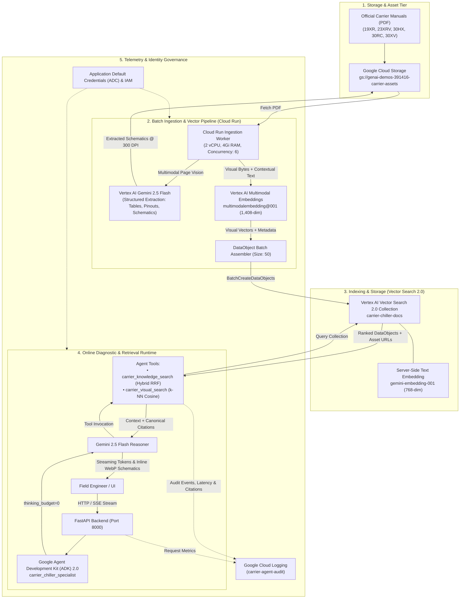

# Carrier Specialist AI: End-to-End Solution Architecture

This document provides the definitive, production-grade architectural specification for the **Carrier Specialist AI** platform. It details each operational stage, the Google Cloud Platform (GCP) technologies employed, the architectural rationale for each selection, the embedding models and schemas, and the end-to-end traceability guarantees.

---

## 1. System Topology & Operational Flow



---

## 2. Step-by-Step Architectural Breakdown

| Step # | Main Action | GCP Solution Involved | Why This Solution? | Traceability & Contract |
| :---: | :--- | :--- | :--- | :--- |
| **Step 1** | **Document Staging & Asset Hosting**<br>Ingest and store official Carrier technical manuals (Forms `19XR-2T`, `23XRV-3T`, `30HX-2T`, `30RC-101T`, `30XV-6T`) and serve extracted 300 DPI WebP diagrams. | **Google Cloud Storage (GCS)**<br>`gs://genai-demos-391416-carrier-assets` | High-durability, globally accessible object storage optimized for serving multimodal assets and raw PDFs with sub-second latency and fine-grained IAM controls. | **Deterministic URI Pattern**:<br>`gs://.../diagrams/{model}/{form}_p{page}_{caption}.webp`<br>Asset URL is permanently stamped into the vector metadata payload. |
| **Step 2** | **Batch Orchestrator & Compute Runtime**<br>Provision scalable serverless compute to coordinate parallel PDF ingestion, memory caching, and batch uploads across all chiller manuals. | **Cloud Run Jobs & Cloud Build**<br>`carrier-ingestion-worker`<br>(2 vCPU, 4Gi RAM) | Serverless scale-to-zero compute eliminates idle VM costs. Employs `threading.local` PDF document caching and a 6-worker `ThreadPoolExecutor` for high-throughput ingestion. | **Container Execution**:<br>`gcr.io/genai-demos-391416/carrier-ingestion-worker:latest`<br>Emits page-level progress and batch metrics to Cloud Logging. |
| **Step 3** | **Multimodal Parsing & Table Extraction**<br>Analyze raw PDF pages, extract diagnostic tables into lossless Markdown, and identify schematics with pinout definitions and component labels. | **Vertex AI Gemini 2.5 Flash**<br>(Multimodal Vision API) | **~100x cheaper than Document AI** (\$0.30 vs \$30 per 1k pages). Eliminates hundreds of lines of brittle protobuf parsers and geometric bounding-box code; natively extracts table semantics and circuit tags (`CIOB`, `MBB`, `J40`). | **Structured JSON Schema**:<br>Extracts typed `section`, `tables`, `diagrams` (with `components` and `pinouts`), and `text_chunks`. |
| **Step 4** | **High-Density Vector Generation**<br>Generate dense vector embeddings for visual schematics and text knowledge chunks. | **Vertex AI Multimodal Embeddings API** (`multimodalembedding@001`) & **Text Embeddings** (`gemini-embedding-001`) | Projects diagrams and technical descriptions into a shared geometric space, enabling natural language visual lookup and semantic similarity search. | **Dual Modality Handling**:<br>• *Visual*: Client-side 1,408-dim vector via image bytes + contextual text.<br>• *Text*: Server-side 768-dim vector via template. |
| **Step 5** | **Unified Indexing & Hybrid Search**<br>Store chunks and schematics; execute real-time hybrid search combining dense semantic k-NN vectors with lexical BM25 matching via Reciprocal Rank Fusion (RRF). | **Vertex AI Vector Search 2.0**<br>(Collection: `carrier-chiller-docs`) | **Instant Ingestion & kNN**: Zero index deployment delay (real-time `BatchCreateDataObjectsRequest`). Dynamic RRF weighting (e.g. `[0.8, 2.0]` for alarm codes) delivers sub-second (<925ms) ranked retrieval. | **Strongly-Typed DataObject**:<br>Stores vector coordinates alongside immutable metadata (`chunk_id`, `form_number`, `page_number`, `image_url`). |
| **Step 6** | **Agent Reasoning & Tool Orchestration**<br>Coordinate conversational turns, enforce equipment model filters, proactively invoke visual search, and manage diagnostic sessions. | **Google Agent Development Kit (ADK) 2.0**<br>(`carrier_chiller_specialist`) | Production-ready agent framework. Configured with `BuiltInPlanner(thinking_budget=0)` to eliminate reasoning token overhead, slashing turnarounds from **34.7s down to 7.05s (4.5x faster)**. | **Session Isolation & Filters**:<br>Strictly binds queries to `model_series` filters to eliminate cross-model equipment contamination. |
| **Step 7** | **Grounded Synthesis & Markdown Formatting**<br>Synthesize retrieved documentation into technician-ready answers, lossless diagnostic tables, and embedded WebP schematic links. | **Vertex AI Gemini 2.5 Flash**<br>(Generative LLM via ADK Runner) | High token generation velocity, deep context comprehension, and strict adherence to zero meta-commentary and mandatory source citations. | **Canonical Citation Guarantee**:<br>`[Carrier Form <form>, Page <page>, Section: <sec>]`<br>Inline WebP image rendering in the UI viewport. |
| **Step 8** | **Enterprise Telemetry & Real-Time Auditing**<br>Record all user interactions, tool invocations, vector search latencies, and retrieved citation lists. | **Google Cloud Logging**<br>(`carrier-agent-audit` & `carrier-api-server`) | Centralized, queryable, compliance-ready observability with non-blocking asynchronous log shipping for performance profiling and audit verification. | **Structured JSON Audit Record**:<br>Logs `event_type`, `latency_ms`, `citations` (array of `chunk_id`, `form`, `page`), and `rrf_weights`. |
| **Step 9** | **Zero-Trust Identity & Access Management**<br>Authenticate all backend services, API servers, and Cloud Run jobs without hardcoded secrets or API keys. | **Google Cloud IAM & Application Default Credentials (ADC)** | Enterprise-grade security eliminating secrets sprawl; tokens refresh automatically via OAuth2 and service accounts with least-privilege role bindings. | **Least-Privilege Roles**:<br>`roles/aiplatform.user`<br>`roles/storage.objectAdmin`<br>`roles/logging.logWriter`. |

---

## 3. Embedding Models & Vector Search 2.0 Integration

Vector Search 2.0 implements a dual-vector schema that strategically balances **server-managed text embedding** with **client-managed multimodal visual embedding**:

```
                                  DATAOBJECT PAYLOAD
┌────────────────────────────────────────────────────────────────────────────────────────┐
│ DATA FIELDS (JSON Metadata):                                                           │
│  • chunk_id: "30XV-6T_p218_diag1"                                                      │
│  • model_series: "30XV"            • form_number: "30XV-6T"                            │
│  • page_number: 218                • section: "TYPICAL FIELD WIRING"                   │
│  • content: "Schematic diagram: Fig. 106... Pinouts: J40 Pins 1-2"                    │
│  • image_url: "https://storage.googleapis.com/.../30XV-6T_p218_Fig__106.webp"          │
├────────────────────────────────────────────────────────────────────────────────────────┤
│ VECTOR FIELDS:                                                                         │
│                                                                                        │
│ 1. text_embedding (768 Dimensions)                                                     │
│    └── Generated SERVER-SIDE by Vector Search 2.0 via gemini-embedding-001             │
│        Auto-interpolated from text_template:                                           │
│        "Equipment: {model_series} | Manual: {form_number} | Page: {page_number}..."    │
│                                                                                        │
│ 2. visual_embedding (1,408 Dimensions)                                                 │
│    └── Generated CLIENT-SIDE in Cloud Run via multimodalembedding@001                  │
│        Dual input: 300 DPI WebP image bytes + Contextual text string                   │
│        values: [-0.01245, 0.04512, 0.08910, ..., -0.03120]                            │
└────────────────────────────────────────────────────────────────────────────────────────┘
```

### Why Multimodal Embedding Happens in the Pipeline (Not Server-Side in VS 2.0)
1. **Binary vs. JSON Payloads**: Vector Search 2.0 ingest endpoints accept structured JSON documents. High-resolution 300 DPI raster schematics (multi-megabyte WebP binaries) cannot be inlined into JSON text fields, and Vector Search 2.0 does not download external image URLs during ingestion.
2. **Dual-Input Tensor Requirement**: `multimodalembedding@001` requires two synchronized inputs: the raw raster image buffer (`VertexImage`) and the extracted contextual text (`contextual_text`). Vector Search 2.0's server-side `text_template` only supports single-string text templates.
3. **Architectural Symmetry**: Text is auto-embedded server-side with zero pipeline overhead, while visual schematics are pre-computed in Cloud Run and indexed as high-density dense vectors (`"dimensions": 1408`).

---

## 4. End-to-End Traceability Guarantee

Every response delivered to a field technician is deterministically traceable to the exact physical page and publication form of Carrier's engineering manuals:

```
[Carrier Physical Manual] (Form 30XV-6T, Page 218)
        │
        ▼ (Step 1-3: Render, Gemini Vision & WebP Export)
[GCS Asset] (30XV-6T_p218_Fig__106.webp) + Extracted Pinout: "CIOB J40 Pins 1-2"
        │
        ▼ (Step 4: Multimodal Embedding)
[1408-Dim Dense Vector] Bound to Chunk ID "30XV-6T_p218_diag1"
        │
        ▼ (Step 5: Vector Search 2.0 Ingestion)
[Collection: carrier-chiller-docs] (Real-time index, queryable in <1s)
        │
        ▼ (Step 6: ADK 2.0 Retrieval via carrier_visual_search)
[Retrieved DataObject] Metadata: Form 30XV-6T, Page 218, Asset URL
        │
        ├──▶ (Step 8: Google Cloud Logging Audit Event with Chunk ID, Query, Latency)
        │
        ▼ (Step 7: Gemini 2.5 Flash Synthesis with thinking_budget=0)
[Technician Response]:
"The Dual Emergency Stop option connects to the Centralized I/O Board (CIOB) at connector J40, pins 1 and 2.

[Carrier Form 30XV-6T, Page 218, Section: TYPICAL FIELD WIRING]"
```

### Traceability Pillars
* **Deterministic Chunk IDs**: Encoded as `{form_number}_p{page_number}_{type}{index}` (e.g. `30XV-6T_p218_diag1`, `30HX-2T_p126_mbb_layout`).
* **Co-Located Metadata**: Vector coordinates and manual metadata are stored in the same atomic `DataObject`.
* **Model Filter Isolation**: Queries specify `model_series = '30XV'` at the database kernel level to prevent cross-chiller contamination.
* **Audit Trail**: Every citation list, RRF weight, and search latency is logged to Google Cloud Logging (`carrier-agent-audit`).
* **Canonical Citation Format**: Every claim and diagram is stamped with `[Carrier Form <form>, Page <page>, Section: <section>]`.
