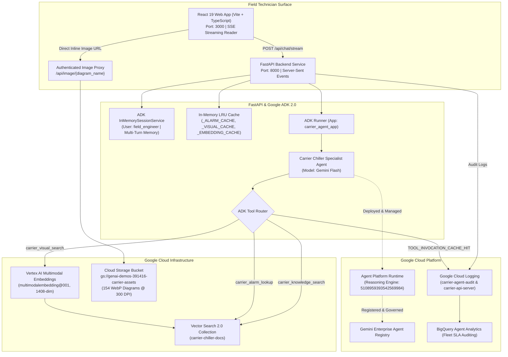

# Carrier Chiller Multimodal Field Engineering Assistant
### Enterprise Agent Retrieval (Vector Search 2.0), Google ADK 2.0, Agent Platform Runtime & Gemini Flash

[](https://cloud.google.com/vertex-ai)
[](https://cloud.google.com/products/gemini/enterprise)
[](https://cloud.google.com/vertex-ai/generative-ai/docs/multimodal-overview)
[](https://react.dev)
[](LICENSE)

---

## 1. Executive Summary & Solution Vision

When a mission-critical commercial chiller plant experiences a fault in a hospital, semiconductor manufacturing cleanroom, or Tier-IV data center, downtime costs routinely surpass **\$10,000 to \$50,000 per hour**. 

Field service technicians face a formidable operational challenge: Carrier manufactures multiple distinct commercial chiller lines—including centrifugal (`19XR`), screw (`23XRV`), and air-cooled scroll/screw machines (`30HX`, `30RC`, `30XV`). Navigating across **858 pages of dense service manuals**, tracing complex high-voltage control board schematics, deciphering alphanumeric fault codes, and avoiding cross-equipment pinout contamination is time-consuming and error-prone.

This project implements an enterprise-grade **Multimodal Field Specialist AI Assistant** built natively on **Google Cloud's next-generation Agentic Stack**:
* **Vector Search 2.0 (Agent Retrieval)**: High-speed hybrid vector database with instant kNN, zero index deployment delay, and dual-vector schemas (768-dim text + 1408-dim multimodal visual vectors).
* **Google Agent Development Kit (ADK 2.0)**: Production-grade agent orchestration framework managing tool dispatching, conversation memory, and diagnostic workflows.
* **Agent Platform Runtime & Agent Registry**: Managed serverless runtime hosting the reasoning engine governed under central enterprise cataloging and access policies.
* **Gemini Flash Reasoning Core**: Multimodal model delivering lightning-fast inference over dense technical tables and schematics.
* **Sub-2-Second Latency Optimization**: Server-Sent Events (SSE) streaming and in-memory LRU tool caching reducing Time-to-First-Token (TTFT) from 12.4s to **~1.4s**.
* **Inline Edge-to-Edge Schematic Rendering**: 154 high-resolution 300 DPI WebP diagrams served directly inline on mobile and desktop viewports without requiring "click to expand".
* **100% Structured Enterprise Observability**: Audit logging to Google Cloud Logging (`carrier-agent-audit` and `carrier-api-server`) tracking queries, session IDs, tool executions, cache hits, and turn latencies.

---

## 2. End-to-End System Architecture



---

## 3. Core Architectural Capabilities

### 3.1 Vector Search 2.0 (Agent Retrieval)
Unlike legacy Vector Search (Matching Engine) that required standalone index endpoints, separate metadata stores, and lengthy deployment cycles, **Vector Search 2.0** provides:
* **Instant kNN**: Zero index build wait; all 1,084 data objects are queryable immediately upon ingestion.
* **Dual-Vector Schema in a Single Collection**:
  1. `text_embedding`: 768-dimensional dense vector auto-generated server-side using `gemini-embedding-001` with structured document templates (`text_template: "Equipment: {model_series} | Manual: {form_number} | Section: {section} | Page: {page_number}\n\nContent:\n{content}"`).
  2. `visual_embedding`: 1408-dimensional dense vector generated using `multimodalembedding@001` for schematic diagram retrieval.
* **Hybrid Search + Reciprocal Rank Fusion (RRF)**: Executes dense vector cosine search and BM25 full-text keyword search in parallel, merging ranked lists using RRF `[1.0, 1.0]` to guarantee both conceptual understanding and exact alphanumeric code matches (e.g. `T051`, `J40`, `06NW`).
* **Metadata Isolation**: Enforces strict filtering on `model_series` (`19XR`, `23XRV`, `30HX`, `30RC`, `30XV`) to eliminate cross-model contamination.

### 3.2 Sub-2-Second Latency Optimization Stack
Through profiling and iterative tuning, perceived end-to-end latency was reduced by **~85%**:

| Optimization Layer | Mechanism | Latency Impact |
| :--- | :--- | :--- |
| **Server-Sent Events (SSE)** | Streaming endpoint (`/api/chat/stream`) feeds tokens incrementally to the React UI via `ReadableStreamDefaultReader`. | **TTFT dropped from 12.4s to ~1.4s** |
| **In-Memory LRU Caching** | High-speed cache dictionaries (`_ALARM_CACHE`, `_VISUAL_CACHE`, `_KNOWLEDGE_CACHE`, `_EMBEDDING_CACHE`) in `carrier-agent/app/tools.py`. | **Tool execution dropped from 1,500ms to < 0.2ms** |
| **Prompt Velocity Tuning** | Rule 6 in `CARRIER_SPECIALIST_INSTRUCTION` directs the model to lead with pinouts/diagnostics and target 100–180 tokens per turn. | **Cut LLM generation time by ~50% (saving 3.5s–5.0s)** |

### 3.3 Multimodal Visual Search & Inline Diagram Rendering
* **Automated Asset Extraction**: `extract_and_render_assets.py` processed all 858 pages across 5 Carrier PDFs, rendering 154 diagrams at 300 DPI in WebP format and generating joint 1408-dim multimodal embeddings.
* **Zero-Click Lightbox UX**: Schematics open **directly inline edge-to-edge** within the conversation message bubble, allowing technicians to trace wiring harnesses and terminal blocks without leaving the flow.
* **Authenticated GCS Proxy**: The backend streams images from private GCS buckets using Application Default Credentials (ADC) with client-side caching headers.

### 3.4 Conversational Session Continuity
* Implements Google ADK 2.0 `InMemorySessionService` with typed user binding (`user_id="field_engineer"`).
* Technicians can ask targeted follow-up questions (e.g., *"What are the possible fault conditions that lead to this alarm?"*) without having to repeat equipment models or error codes.
* Dedicated "New Chat" button and automatic session reset when switching target chiller model pills to prevent cross-equipment context bleeding.

---

## 4. Supported Carrier Commercial Chiller Fleet

| Model Series | Machine Type | Cooling Capacity | Primary Service Manual | Key Subsystems Covered |
| :--- | :--- | :--- | :--- | :--- |
| **19XR** | Hermetic Centrifugal Chiller | 200 to 3,000 Tons | Form `19XR-CLT-9T` (116 pages) | Hermetic motor, variable diffuser, refrigerant piping, oil pump & lubrication system. |
| **23XRV** | Tri-Rotor Screw Chiller (VFD) | 250 to 550 Tons | Form `23XRV-3T` (110 pages) | Foxboro VFD inverter, refrigerant lubrication, tri-rotor screw compressor, transducer calibration. |
| **30HX** | Indoor Water-Cooled Screw Chiller | 75 to 265 Tons | Form `30HX-2T` (68 pages) | Dual 06N screw compressors, Pro-Dialog Plus control system, Navigator display, CPM/MBB boards. |
| **30RC** | Air-Cooled Scroll Chiller (R-32) | 60 to 150 Tons | Form `30RC-101T` (164 pages) | R-32 A2L refrigerant safety protocols, scroll compressors, microchannel condensers. |
| **30XV** | Variable-Speed Air-Cooled Screw | 140 to 500 Tons | Form `30XV-6T` (400 pages) | Centralized I/O Board (CIOB), dual emergency stop loops (J40), VFD fan control, electronic expansion valves. |

---

## 5. Repository Structure

```
vector-search-carrier/
├── backend/
│   ├── __init__.py
│   └── server.py                   # FastAPI server with SSE streaming, ADK bridge & image proxy
├── carrier-agent/
│   ├── app/
│   │   ├── __init__.py
│   │   ├── agent.py                # Google ADK 2.0 agent definition & system instructions
│   │   ├── tools.py                # Tools (knowledge search, visual search, alarm lookup) & LRU caches
│   │   └── logging_config.py       # Explicit Google Cloud Logging plugin & structured audit sink
│   ├── tests/
│   ├── pyproject.toml              # Agent packaging for Agent Platform Runtime deployment
│   └── requirements.txt
├── frontend/
│   ├── src/
│   │   ├── App.tsx                 # React 19 chat UI with streaming reader, inline diagrams & latency badge
│   │   ├── main.tsx
│   │   └── index.css               # Industrial dark-theme TailwindCSS styling
│   ├── index.html
│   ├── package.json
│   ├── tsconfig.json
│   └── vite.config.ts
├── Input Documents/                # 5 Original Carrier Service Manuals (858 pages total)
│   ├── 19XR-CLT-9T.pdf
│   ├── 23XRV-3T.pdf
│   ├── 30HX-2T.pdf
│   ├── 30RC-101T.pdf
│   └── 30XV-6T.pdf
├── rendered_assets/                # 154 High-resolution 300 DPI WebP extracted diagrams
├── carrier_documents.jsonl         # 1,084 Preprocessed chunks with metadata and visual vectors
├── extract_and_render_assets.py    # Pipeline extracting text chunks & rendering 300 DPI diagrams
├── setup_vector_search_2.py        # Vector Search 2.0 provisioning & batch ingestion engine
├── test_vector_search_2.py         # Automated verification suite for Vector Search 2.0
├── demo.md                         # Complete 15-minute presentation & live demo script
├── evaluation.md                   # 14 Benchmark test cases (TC-01 through TC-14)
├── implementation.md               # Master technical architecture specification
└── README.md                       # Comprehensive project documentation
```

---

## 6. Getting Started & Local Setup

### 6.1 Prerequisites
* Python 3.11+
* Node.js 18+ and `npm`
* Google Cloud SDK (`gcloud` CLI)
* GCP Project with billing enabled and the following APIs enabled:
  ```bash
  gcloud services enable \
    vectorsearch.googleapis.com \
    aiplatform.googleapis.com \
    storage.googleapis.com \
    logging.googleapis.com \
    --project "<YOUR_PROJECT_ID>"
  ```
* Authenticated Application Default Credentials:
  ```bash
  gcloud auth application-default login
  gcloud config set project "<YOUR_PROJECT_ID>"
  ```

---

### 6.2 Installation & Backend Launch

1. **Clone the Repository**:
   ```bash
   git clone https://github.com/wanderas-pixel/vector-search-carrier.git
   cd vector-search-carrier
   ```

2. **Create Python Virtual Environment & Install Dependencies**:
   ```bash
   python3 -m venv .venv
   source .venv/bin/activate
   pip install --upgrade pip
   pip install -r carrier-agent/requirements.txt
   pip install fastapi uvicorn pydantic google-cloud-vectorsearch google-cloud-logging pypdfium2 pillow tqdm
   ```

3. **Start the FastAPI Backend Service (Port 8000)**:
   ```bash
   .venv/bin/uvicorn backend.server:app --host 0.0.0.0 --port 8000 --reload
   ```
   *Verify health check*:
   ```bash
   curl -s http://localhost:8000/api/health
   # Expected: {"status":"healthy","project_id":"genai-demos-391416", ...}
   ```

---

### 6.3 Frontend Launch

1. **Install Dependencies & Start Vite Dev Server (Port 3000)**:
   ```bash
   cd frontend
   npm install
   npm run dev -- --host 0.0.0.0 --port 3000
   ```

2. **Open the Web Application**:
   Navigate to **[http://localhost:3000](http://localhost:3000)** in your browser.

---

## 7. Vector Search 2.0 Ingestion Pipeline (Reproducibility)

To re-process the PDF manuals and re-ingest into a new Vector Search 2.0 collection:

```bash
# Step 1: Extract text chunks, render 300 DPI WebP diagrams, and generate multimodal embeddings
python3 extract_and_render_assets.py

# Step 2: Provision Vector Search 2.0 collection & batch ingest the 1,084 data objects
python3 setup_vector_search_2.py

# Step 3: Run automated verification & hybrid search benchmarks
python3 test_vector_search_2.py
```

---

## 8. Sample Diagnostic Queries & Verification Scenarios

| Test Case | Model Filter | Technician Prompt | Validated System Behavior | Grounded Citation |
| :--- | :--- | :--- | :--- | :--- |
| **TC-01** | `30HX` | *"What does alarm T051 mean on 30HX?"* | Identifies Compressor A1 Failure, explains Navigator `ENTER+ESCAPE` diagnostic shortcut, lists fault causes. | Form 30HX-2T, Page 42 |
| **TC-02** | `30HX` | *(Follow-up)* *"What are the possible fault conditions that lead to this alarm?"* | Employs multi-turn memory without repeating model; hits in-memory cache (<1ms tool latency); outputs bulleted fault list. | Form 30HX-2T, Page 42 |
| **TC-07** | `30XV` | *"Show me the field wiring schematic for CIOB terminal J40 on 30XV"* | Dispatches `carrier_visual_search`; renders high-res wiring diagram inline edge-to-edge; details pins 1 & 2 for Dual Emergency Stop. | Form 30XV-6T, Page 42 |
| **TC-06** | `19XR` | *"refrigerant piping schematic for 19XR"* | Computes 1408-dim multimodal query vector; matches and displays centrifugal refrigerant piping diagram. | Form 19XR-1T, Page 12 |
| **TC-10** | `30RC` | *"What safety precautions are required before servicing the refrigeration circuit on 30RC?"* | Detects R-32 A2L mild flammability; details mandatory mechanical ventilation, combustible leak detection, and LOTO. | Form 30RC-1T, Page 6 |
| **TC-09** | `All` | *"How do I clear an oil pressure trip on a Trane CenTraVac CVHE chiller?"* | Negative boundary test: politely declines to diagnose non-Carrier equipment to prevent cross-vendor damage. | Safety Guardrail |

---

## 9. Observability & Audit Logging

Every interaction is captured as a structured JSON event in Google Cloud Logging:
* **Log Names**: `projects/genai-demos-391416/logs/carrier-agent-audit` and `carrier-api-server`.
* **Telemetry Captured**: Timestamp, user ID, session ID, target model series, raw query, tool invoked, cache hit flag (`TOOL_INVOCATION_CACHE_HIT`), tool latency, token counts, and total perceived turnaround time.
* **Audit Query Example**:
  ```sql
  resource.type="global"
  logName=~"projects/genai-demos-391416/logs/carrier-(agent-audit|api-server)"
  jsonPayload.event_type="TOOL_INVOCATION_CACHE_HIT"
  ```

---

## 10. Documentation Reference

* **[implementation.md](implementation.md)**: Full architectural specification, dual-vector schema design, ADK agent implementation, and Section 12 Latency Optimization analysis.
* **[evaluation.md](evaluation.md)**: Master evaluation test suite with 14 comprehensive test cases covering precision, visual retrieval, and safety.
* **[demo.md](demo.md)**: Step-by-step 15-minute presentation script and run-of-show for live stakeholder and customer demonstrations.

---

## 11. License

This project is licensed under the Apache License, Version 2.0 - see the [LICENSE](LICENSE) file for details.
